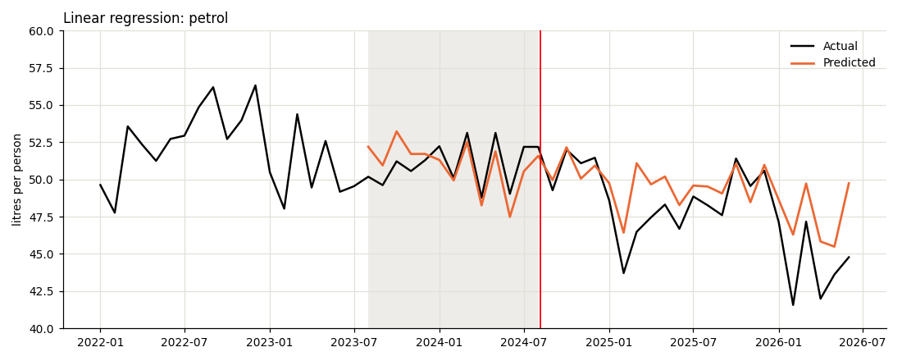
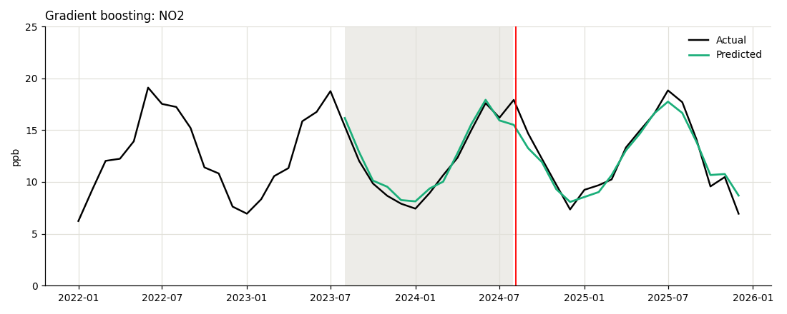
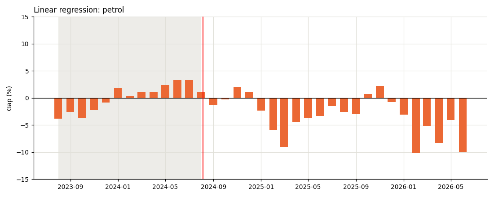
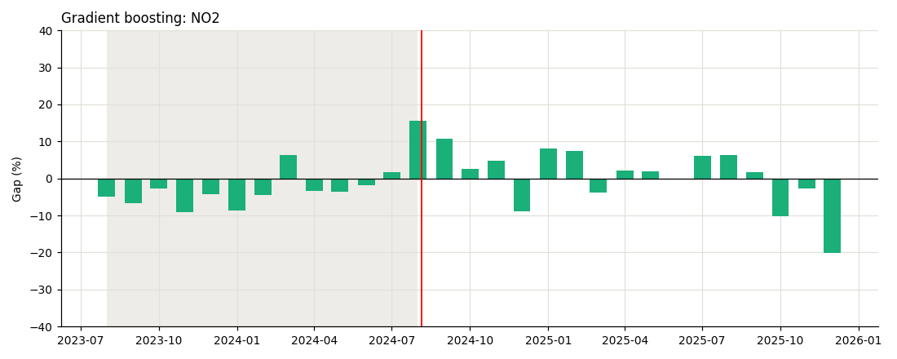
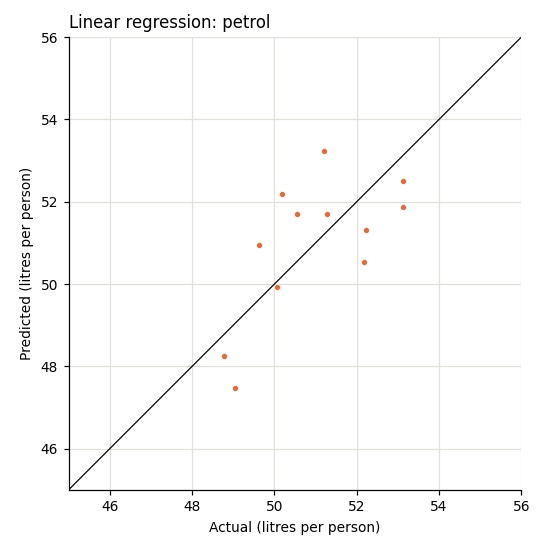
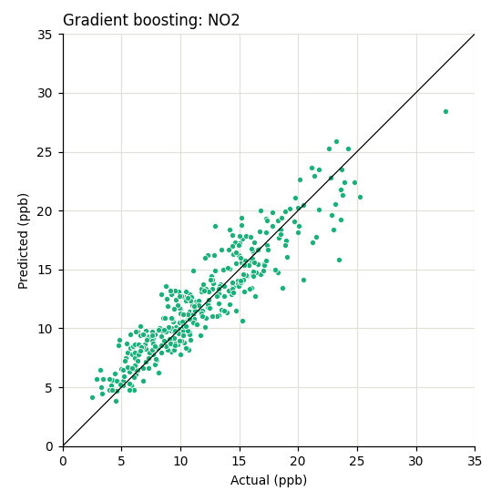

# Modelling guide: petrol and air quality

There are two data files in this folder. This note explains what to do with them.

We're building several different models because any single model can be wrong in its own way. If they all point to the same answer we can trust it, and if they disagree we know the result isn't solid yet.

## What we're doing

We want to know if the 50 cent fare (started 5 August 2024) cut petrol use and roadside air pollution.

Train a model on data from before the fare cut, then let it predict the period after. If the real numbers come in lower than the prediction, that difference is the effect of the fare.

## The files

| File | One row is | Column to predict |
|---|---|---|
| `petrol_monthly.csv` | one month, 2010 to 2026 | `qld_litres_pp`, litres of petrol per Queenslander |
| `no2_daily.csv` | one day, 2016 to 2025 | `no2_ppb`, air pollution beside a busy road in South Brisbane |

## Who does what

Everyone builds one model and runs it on both files. Pick any of the models below, and please drop a message in the WhatsApp group so we don't end up picking the same one.

| Model | Chart colour |
|---|---|
| Prophet | purple `#4a3aa7` |
| SARIMAX | blue `#2a78d6` |
| Linear regression | orange `#eb6834` |
| Gradient boosting | green `#1baf7a` |

## The `split` column

Both files have a `split` column that tells you which rows to use. Please don't make your own split, or our results won't line up.

| `split` | What to do with those rows |
|---|---|
| `train` | Train your model |
| `validation` | Test your model. This is Aug 2023 to Jul 2024, the last normal year |
| `policy` | Predict these. They are after the fare cut, so never train on them |
| `unused` | Ignore. COVID, floods and the cyclone |

```python
import pandas as pd
df = pd.read_csv("petrol_monthly.csv")        # or no2_daily.csv
train = df[df["split"] == "train"]
validation = df[df["split"] == "validation"]
policy = df[df["split"] == "policy"]
```

## Which columns to use as inputs

Petrol: `ctrl_litres_pp` (petrol per person in NSW and Victoria), `month_of_year`, `days_in_month`.

NO2: `wind_speed`, `wind_u`, `wind_v`, `temp_c`, `temp_min_c`, `humidity_pct`, `pressure_hpa`, `rain_mm`, `day_of_week`, `day_of_year`, `is_public_holiday`, `is_school_holiday`.

NO2 needs one more column. Pollution dropped in 2020 and stayed lower, and the model has to know about it. Use `t` if your model is gradient boosting. Use `post_covid` if it is linear regression, SARIMAX or Prophet.

Prophet works out the monthly and weekly patterns by itself, so leave out `month_of_year`, `day_of_week` and `day_of_year` if you are using it.

## Steps

1. Tune your model, using only the `train` rows. See "Tuning" below.
2. Train on the `train` rows with your best settings.
3. Predict the `validation` rows and work out your error and bias.
4. Train again on `train` and `validation` together.
5. Predict the `policy` rows and work out the gap.
6. Do the extra run below and work out the gap again.
7. Make the charts.

| Number | How to work it out | Good result |
|---|---|---|
| Error | average of `abs(predicted - actual) / actual`, times 100 | as low as possible |
| Bias | `(total predicted - total actual) / total actual`, times 100 | close to zero |
| Gap | `(total actual - total predicted) / total predicted`, times 100 | negative means less petrol or pollution than expected |

## Tuning

If your model has settings, tune them before you do anything else. Default settings are rarely the best ones.

| Model | What to tune |
|---|---|
| SARIMAX | The order numbers (p, d, q) and the seasonal ones (P, D, Q). Trying 0, 1 and 2 for p and q is enough |
| Gradient boosting | Tree depth, number of trees, learning rate, minimum leaf size |
| Linear regression | Nothing in plain linear regression. If you use Ridge or Lasso, tune `alpha` |
| Prophet | `seasonality_prior_scale` and `seasonality_mode` (additive or multiplicative) |

How to do it:

1. Hold back the last year of the `train` rows, August 2022 to July 2023.
2. Train on the earlier `train` rows with a few different settings.
3. Keep the settings with the lowest error on the year you held back.
4. Carry on with step 2 above, using those settings on all the `train` rows.

Don't use the `validation` or `policy` rows to pick settings. The validation year is there to compare our models fairly, and that only works if nobody tuned on it.

Keep a note of the settings you tried and the ones you kept. We need them for the report.

## The extra run

We need to show the result doesn't depend on one choice, so everyone runs their model a second time with one change. Use the same tuned settings.

- Petrol: swap `ctrl_litres_pp` for `ctrl_all_litres_pp`, which is every other state combined.
- NO2: add `bg_no2_ppb` as an input. It is the reading from a quiet suburban monitor.

## Things to watch

- Stick to the input columns listed above. Some of the other columns are calculated from the answer.
- Petrol has only 93 training rows. That is fine for linear regression and SARIMAX. Gradient boosting will memorise them, so include small settings when you tune (shallow trees, not many of them).
- Gradient boosting on petrol: predict `qld_litres_pp / ctrl_litres_pp`, then multiply back by `ctrl_litres_pp`. Tree models can't predict a value lower than anything they saw in training, and petrol use keeps falling.
- SARIMAX needs every date in order. Keep the `unused` rows and blank out their target. It also needs `pip install statsmodels`.
- `rain_mm` is empty for the first half of 2016. Fill it with zero.
- Prophet needs `pip install prophet`. It wants the date column renamed to `ds` and the column to predict renamed to `y`. Set `growth="flat"`, because its default straight-line trend keeps sloping after 2024 and invents a rise in pollution. It can't take empty cells in the input columns, so fill those first. Gaps in the dates are fine, so just leave the `unused` rows out.

A Prophet model for petrol looks like this. The predictions come back in `pred["yhat"]`.

```python
from prophet import Prophet
m = Prophet(growth="flat", weekly_seasonality=False, daily_seasonality=False, interval_width=0.95)
m.add_regressor("ctrl_litres_pp")
m.add_regressor("days_in_month")
m.fit(train.rename(columns={"month": "ds", "qld_litres_pp": "y"}))
pred = m.predict(validation.rename(columns={"month": "ds"}))
```

For NO2, set `weekly_seasonality=True`, rename `date` and `no2_ppb` instead, and add each input column with `add_regressor`.

## Charts to make

Make the same three charts for each file, from your main run. If we all use the same settings we can put them side by side in the report.

The `examples` folder has all three charts for both files, and they are shown below. They come from quick models with default settings, so use them for the layout only. Your numbers will be different.

Settings for every chart:

- Size 10 by 4 for charts 1 and 2, and 5 by 5 for chart 3.
- Actual values in black, your predictions in your model's colour from the table above.
- Model and file in the title, like "Linear regression: petrol".
- Save as PNG, named like `linear_petrol_1.png`.

### Chart 1: actual and predicted over time

A line chart from January 2022 to the end of the data.

- Black line: actual values for the whole period.
- Coloured line: your predictions for the validation rows and the policy rows.
- Red vertical line at 5 August 2024.
- Light grey shading over the validation year, August 2023 to July 2024.
- Petrol: y-axis from 40 to 60 litres.
- NO2: daily values are too jumpy to read, so average both lines by month first. Y-axis from 0 to 25.

The two lines should sit together in the grey year. After the red line, any space between them is the effect of the fare.





### Chart 2: the gap, month by month

A bar chart with one bar per month, from August 2023 to the end of the data.

- Bar height is `(actual - predicted) / predicted`, times 100, for that month. For NO2, use the monthly averages.
- Line at zero, red vertical line at 5 August 2024, same grey shading as chart 1.
- Petrol: y-axis from -15 to 15.
- NO2: y-axis from -40 to 40.

The bars in the grey year show how far off your model normally is. If the bars after the red line look the same, there is no effect. If they sit clearly below zero, there is one.





### Chart 3: predicted against actual

A scatter plot of the validation rows only, with actual on the x-axis and predicted on the y-axis.

- Draw the diagonal line where predicted equals actual.
- Petrol: both axes from 45 to 56.
- NO2: both axes from 0 to 35.

The closer the dots are to the line, the better the model.

 

### One more, if your model has it

- Linear regression: a bar chart of the coefficients.
- Gradient boosting: a bar chart of feature importance.
- Prophet: on chart 1, shade the area between `yhat_lower` and `yhat_upper`. That is the range the model expects 95% of the time, so months where the black line drops below it are the ones that count.

These show what drives petrol use and pollution, which is easy to talk about in the report.

The charts above are the minimum. Feel free to add any other chart you think would help the analysis.

## For the combined charts

We will make three charts that compare all the models: every model's predictions on one chart 1, error by model, and gap by model for both runs. A simple "copy last year" forecast will be added to them in grey, to show that each model beats it. For that, share two things.

Your numbers, in this layout:

| Model | File | Run | Error | Bias | Gap |
|---|---|---|---|---|---|
| Linear regression | petrol | main | | | |
| Linear regression | petrol | extra | | | |
| Linear regression | NO2 | main | | | |
| Linear regression | NO2 | extra | | | |

Your predictions from the main run, one CSV per file, named like `linear_petrol_predictions.csv`. It needs four columns: date, actual, predicted and split, for the validation and policy rows.

